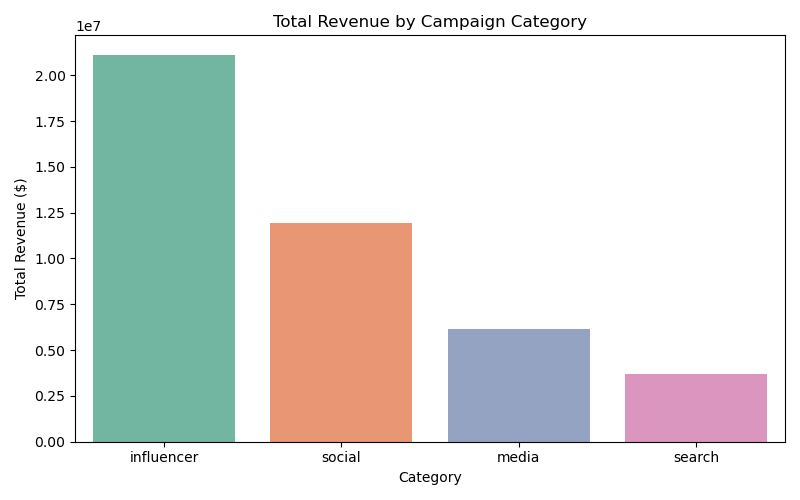
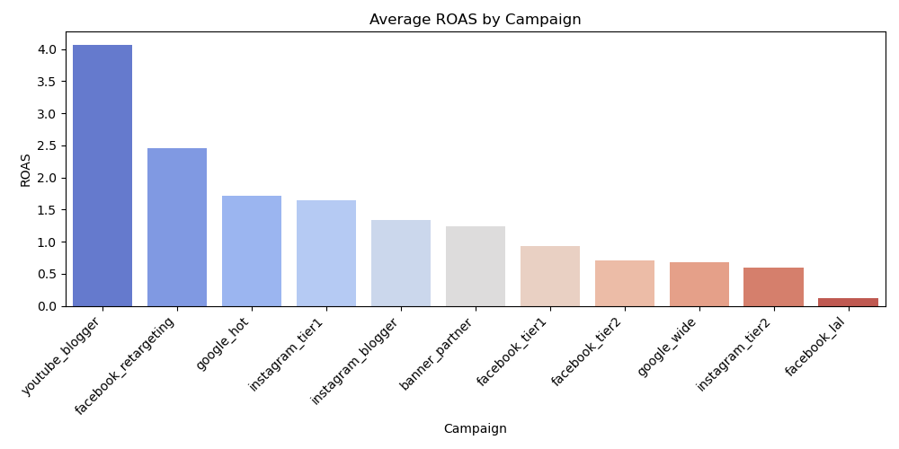
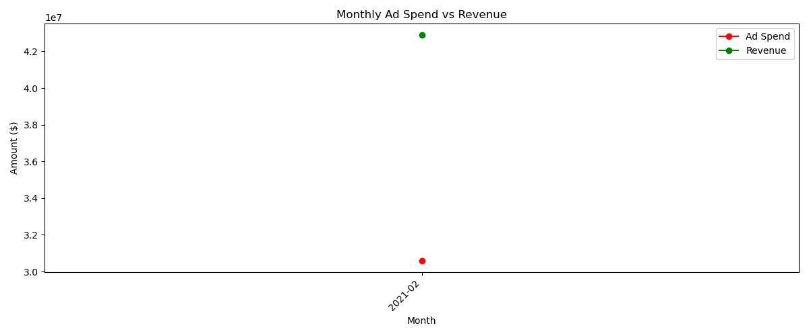
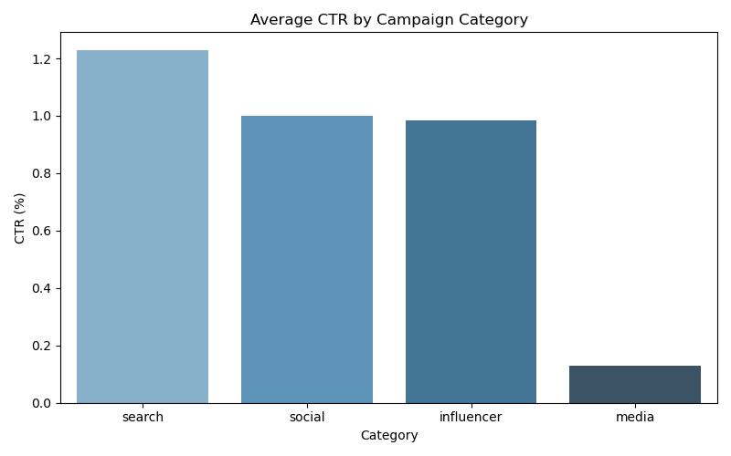
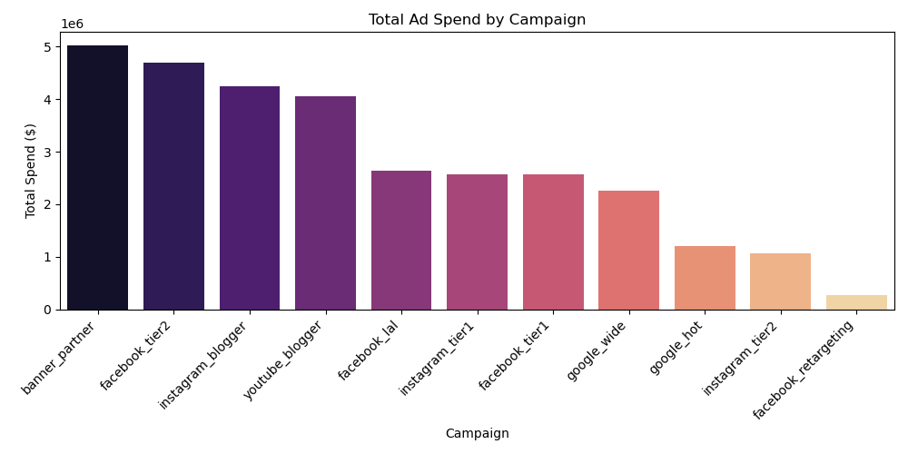

# Programmatic Advertising Performance Dashboard

## Problem Statement
Digital advertising campaigns generate massive amounts of data across impressions, clicks, leads, and conversions. This project analyzes programmatic advertising performance across social and search campaigns, tracking key metrics like CTR, CPC, ROAS, and conversion rates to identify top-performing campaigns and optimize budget allocation.

## Tools & Technologies
- **Python** (Pandas, NumPy, Matplotlib, Seaborn)
- **Tableau** (Interactive performance dashboard)
- **Dataset:** Marketing Spending Dataset — [Kaggle Link](https://www.kaggle.com/datasets/sinderpreet/analyze-the-marketing-spending)

## 📁 Project Structure
```
programmatic-advertising-dashboard/
│
├── data/
│   └── marketing_data.csv          # Raw dataset
│
├── notebooks/
│   └── advertising_analysis.py     # Main analysis script
│
├── visuals/
│   └── *.png                       # Generated charts
│
└── README.md
```

## Key Analysis Areas
- Revenue and ROAS by campaign type and category
- Monthly ad spend vs revenue trends
- CTR and conversion rate by campaign category
- Budget pacing and spend distribution across campaigns

## Visualizations






## How to Run
```bash
git clone https://github.com/itsswatii/programmatic-advertising-dashboard.git
cd programmatic-advertising-dashboard
pip install -r requirements.txt
python notebooks/advertising_analysis.py
```

## Results & Insights
- **Total Impressions:** 1.5B+ across social and search campaigns
- **Total Ad Spend:** $30.6M with **Total Revenue:** $42.9M generated
- **Overall ROAS:** 1.41 — revenue exceeded ad spend across all campaigns
- **Overall CTR:** 0.96% with **CPC:** $11.27
- **Total Orders:** 8,043 with an overall conversion rate of 0.28%

